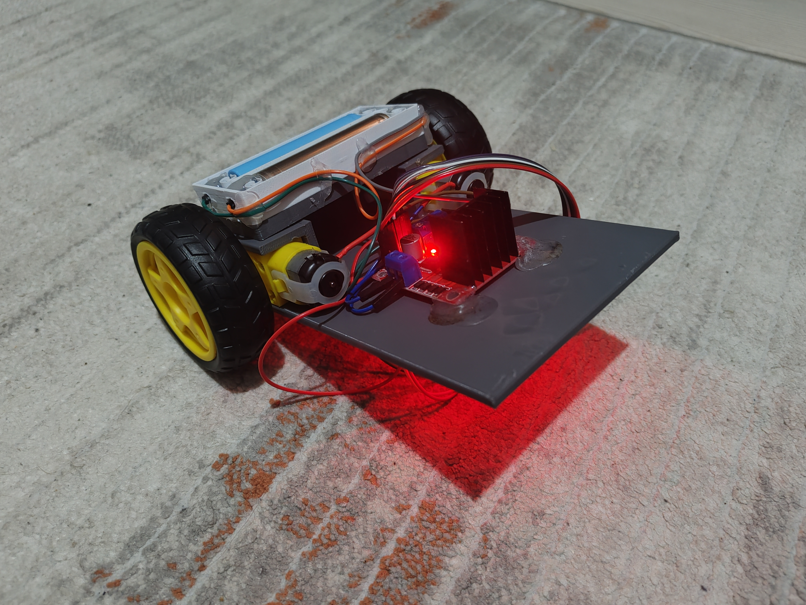

# 🤖 Self-Balancing Vertical Robot

<p align="left">
  
</p>

[](https://github.com/BeratTezer/self-balancing-vertical-robot/actions)
[](LICENSE)
[](CITATION.cff)
[](docs/)

The **Self-Balancing Vertical Robot** is a modular research platform featuring a 3D-printed chassis, low-cost electronic components, and open-source software, designed for both **academic research** and **industrial prototyping**.

---

## 📑 Table of Contents

[✨ Features](#-features)<br>
[⚙️ Hardware (BOM)](#️-hardware-bom)<br>
[🖨️ 3D Printing](#️-3d-printing)<br>
[💻 Software](#-software)<br>
[🧠 Algorithms](#-algorithms)<br>
[🧪 Tests & Results](#-tests--results)<br>
[🗺 Roadmap](#-roadmap)<br>
[📚 References](#-references)<br>
[🤝 Contribution & License](#-contribution--license)<br>
[🔖 Citation](#-citation)

---

## ✨ Features

- ⚡ Arduino UNO-based control system
- 🎥 IMU-based motion sensing and orientation estimation
- 🔋 Modular chassis powered by a 2S Li-ion battery pack
- 🖨️ Fully customizable using 3D-printed components

---

## ⚙️ Hardware (BOM)

| Parça        | Adet | Açıklama      | Link                                    |
| ------------ | ---- | ------------- | --------------------------------------- |
| ESP32 DevKit | 1    | Ana kontrolcü | [Datasheet](https://www.espressif.com/) |
| SG90 Servo   | 4    | Aktüatör      | -                                       |
| MPU6050      | 1    | IMU sensörü   | -                                       |
| L298N        | 1    | Motor sürücü  | -                                       |
| 18650 Li-ion | 2    | Güç kaynağı   | -                                       |

Daha detaylı liste: [`hardware/bom.md`](hardware/bom.md)

---

## 🖨️ 3D Baskı

- STL/STEP dosyaları: [`hardware/3d-models/`](hardware/3d-models/)
- Önerilen baskı ayarları:
  - Katman yüksekliği: **0.2 mm**
  - İnfill: **%20 – %40**
  - Malzeme: **PLA / PETG**

Montaj görselleri: 

---

## 💻 Yazılım

📂 Kod yapısı:

```
software/
├── src/
│   ├── main.cpp
│   ├── control.cpp
│   └── telemetry.cpp
├── include/
│   ├── control.h
│   └── config.h
└── tests/
    └── test_plan.md
```

### 🚀 Hızlı Başlangıç

**PlatformIO:**

```bash
git clone https://github.com/USERNAME/ProjectName.git
cd ProjectName/software
pio run -t upload
pio device monitor
```

**Arduino IDE:**

1. ESP32 kart tanımlarını yükleyin.
2. `main.cpp` dosyasını açın.
3. Kütüphaneleri kurun (`Wire`, `MPU6050`, `Servo`).
4. Upload butonuna basın.

---

## 🧠 Algoritmalar

- **PID kontrol** → dengeleme ve hız sabitleme
- **Sensör füzyonu** → IMU + opsiyonel kamera
- **(Opsiyonel) SLAM** → kamera verileriyle çevre haritalama

---

## 🧪 Testler & Sonuçlar

- ⚡ Maksimum hız: 1.2 m/s
- 🔋 Pil ömrü: ~40 dk sürekli kullanım
- 🎯 PID açı hatası: ±2°
- 📹 [Demo Videosu](media/videos/demo.mp4)

---

## 🗺 Yol Haritası

- [ ] Stereo kamera ile görsel SLAM
- [ ] Yol planlama için A\* algoritması
- [ ] ROS2 entegrasyonu

---

## 📚 Kaynakça

- Espressif ESP32 dökümantasyonu
- Welch & Bishop, _An Introduction to the Kalman Filter_
- Thrun et al., _Probabilistic Robotics_
- Ayrıntılar: [`docs/references.md`](docs/references.md)

---

## 🤝 Katkı & Lisans

Katkılar memnuniyetle kabul edilir. Lütfen [CONTRIBUTING.md](CONTRIBUTING.md) dosyasına göz atın.  
Bu proje **MIT Lisansı** altında yayınlanmıştır.

---

## 🔖 Atıf

Bu projeyi kullanırsanız lütfen **CITATION.cff** dosyasına göre atıf verin.
